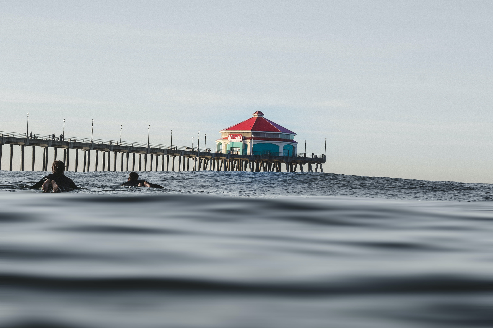
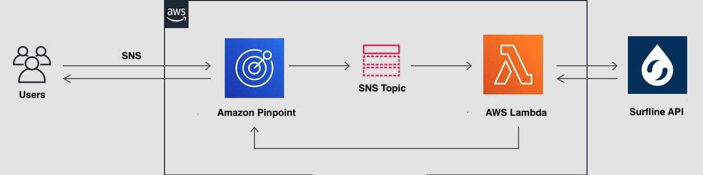

# ca_surfbot

  

## Description
This app allows you to get information on major surfing spots in California by sending text messages on your mobile phone*. By sending a text message, you can start a conversation, and by following the directions, you can get wave information from Surfline, a major surfing information website, for the surf spot you want to visit.

Currently, we are assuming that the user is a resident of Los Angeles, California. You can get the same day wave information for Huntington Beach, Trestles, Ventura, Malibu and Oceanside, which are all easily accessible from within Los Angeles and are world class surf spots.

Phone number: 833-709-2033

## Demo

Using SMS, users can send a text message to ca_surfbot and it will reply with the surf information of the desired location for that day.

https://user-images.githubusercontent.com/88815405/151932940-034af625-867d-40e1-aeae-be8a6f561503.mp4

## CA_surfbot Architecture

In this app, we use AWS Lambda and the services listed below.
AWS Lambda -- Standalone microservices that are triggered by events
AWS Simple Notification Service (SNS) -- Messaging service between microservices
AWS Pinpoint

  

